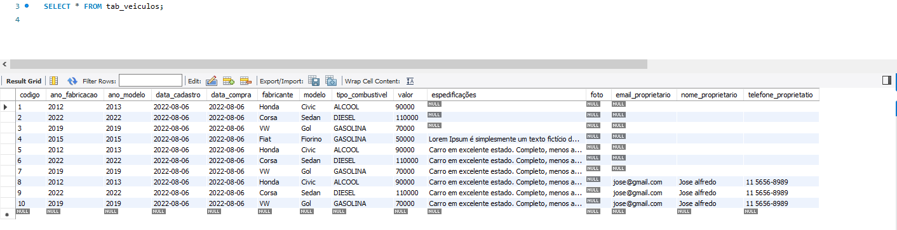

# mapeamento-jpa-hibernate

## Chaves compostas

Para exemplificar o uso de chaves compostas, incluiremos os atributos cidade
e placa como identificador de Veiculo. O atributo codigo não será mais o
identificador, por isso precisaremos eliminá-lo.

Criaremos uma classe chamada VeiculoId para representar o identificador (a
chave composta) da entidade.

@Embeddable
public class VeiculoId implements Serializable {
private static final long serialVersionUID = 1L;
private String placa;
private String cidade;

Veja que anotamos a classe VeiculoId com @Embeddable, pois ela será sempre
utilizada de forma “embutida” em outra classe.

Na classe Veiculo, criamos um atributo id do tipo VeiculoId e anotamos seu
atributo apenas com @EmbeddedId.

Para persistir um novo veículo, é preciso informar a cidade e placa, que faz parte
do identificador. Instanciaremos um VeiculoId e atribuiremos ao id do veículo.

public static void main(String[] args) {
EntityManager manager= JPAUtil.getEntityManager();
EntityTransaction tx= manager.getTransaction();
tx.begin();

        Veiculo veiculo10= new Veiculo(new VeiculoId("ABC-1234","Diadema"),"Fiat","Fiorino",2015,2015,50000.00);

        manager.persist(veiculo10);

        tx.commit();
        manager.close();
        JPAUtil.close();

    }
}

Para buscar um veículo pela chave, precisamos também instanciar um VeiculoId
e chamar o método find de EntityManager, passando como parâmetro a instância
de VeiculoId.

O método find() da interface EntityManager é usado quando precisamos pesquisar e retornar 
uma instância de uma determinada classe e retorná-la a partir do contexto de persistência.

## Enumerações

Enumerações em Java é um tipo que define um número finito de valores
(instâncias), como se fossem constantes.

Na classe Veiculo, incluiremos uma enumeração TipoCombustivel, para
representar os possíveis tipos de combustíveis que os veículos podem suportar.
Primeiro, definimos a enum:

public enum TipoCombustivel {
    ALCOOL,
    GASOLINA,
    DIESEL,
    BICOMBUSTIVEL
}

Depois, criamos a propriedade tipoCombustivel do tipo TipoCombustivel na classe
Veiculo e configuramos seu mapeamento:

public class Veiculo {
...
private TipoCombustivel tipoCombustivel;
...
@Column(name = "tipo_combustivel", nullable = false)
@Enumerated(EnumType.STRING)
public TipoCombustivel getTipoCombustivel() {
    return tipoCombustivel;
}
public void setTipoCombustivel(TipoCombustivel tipoCombustivel) {
    this.tipoCombustivel = tipoCombustivel;
}
...

O novo atributo foi mapeado como uma coluna normal, porém incluímos a
anotação @Enumerated, para configurar o tipo da enumeração como string.
Fizemos isso para que a coluna do banco de dados armazene o nome da
constante, e não o número que representa a opção na enumeração.

Para inserir um novo veículo no banco de dados, atribuímos também o tipo do
combustível, como você pode ver no exemplo abaixo:

Veiculo veiculo = new Veiculo();
veiculo.setFabricante("Ford");
veiculo.setModelo("Focus");
veiculo.setAnoFabricacao(2011);
veiculo.setAnoModelo(2012);
veiculo.setValor(new BigDecimal(41_500));
veiculo.setTipoCombustivel(TipoCombustivel.BICOMBUSTIVEL);
manager.persist(veiculo);

Se o parâmetro da anotação @Enumerated for alterado para EnumType.ORDINAL
(padrão), será inserido o número que representa a opção na enumeração. No caso
da gasolina, esse valor seria igual a 1.

@Column(name = "tipo_combustivel", nullable = false)
@Enumerated(EnumType.ORDINAL)
public TipoCombustivel getTipoCombustivel() {
    return tipoCombustivel;
}

## Propriedades temporais

O tipo de uma propriedade é automaticamente detectado, mas para uma
propriedade do tipo Date ou Calendar, você pode precisar definir a precisão da
data/hora, com a anotação @Temporal.

@Temporal(TemporalType.DATE)
@Column(name = "data_cadastro", nullable = false)
private Date dataCadastro;

public Date getDataCadastro() {
    return dataCadastro;
}

O mapeamento acima, do atributo dataCadastro, diz que apenas a data é
importante, por isso, ao criarmos/atualizarmos a tabela usando o hbm2ddl, uma
coluna do tipo DATE será criada, se usarmos MySQL.

Veiculo veiculo = new Veiculo();
veiculo.setFabricante("GM");
veiculo.setModelo("Celta");
veiculo.setAnoFabricacao(2008);
veiculo.setAnoModelo(2008);
veiculo.setValor(new BigDecimal(12_000));
veiculo.setTipoCombustivel(TipoCombustivel.GASOLINA);
veiculo.setDataCadastro(new Date());
manager.persist(veiculo);

A JPA não define a precisão que deve ser usada se @Temporal não for especificada,
mas quando usamos Hibernate, as propriedades de datas usam a definição
TemporalType.TIMESTAMP por padrão. Outras opções são TemporalType.TIME e
TemporalType.DATE.

## Propriedades transientes

As propriedades de uma entidade são automaticamente mapeadas, se não
especificarmos nenhuma anotação. Por diversas vezes, podemos precisar criar
atributos e/ou métodos getters que não representam uma coluna no banco de
dados. Nestes casos, devemos anotar com @Transient.

@Transient
public String getDescricao() {
    return this.getFabricante() + " " + this.getModelo()
           + " " + this.getAnoFabricacao() + "/" + this.getAnoModelo()
+ " por apenas " + this.getValor();

}

A propriedade será ignorada totalmente pelo mecanismo de persistência. O
método getDescricao é apenas um método de negócio, que retorna uma descrição
comercial do veículo.
Veiculo veiculo = manager.find(Veiculo.class, 9L);
System.out.println(veiculo.getDescricao());

## Objetos grandes

Quando precisamos armazenar muitos dados em uma coluna, por exemplo um
texto longo, um arquivo qualquer ou uma imagem, mapeamos a propriedade
com a anotação @Lob.

Objeto grande em caracteres (CLOB)

Um CLOB (Character Large Object) é um tipo de dado em bancos de dados que
pode armazenar objetos grandes em caracteres (textos muito longos).

Para mapear uma coluna CLOB em JPA, definimos uma propriedade com o tipo
String, char[] ou Character[] e anotamos com @Lob.

public class Veiculo {
...
@Lob
private String especificacoes;
...

public String getEspecificacoes() {
return especificacoes;
}
...
}

Vamos persistir um novo veículo, incluindo uma especificação.

EntityManager manager = JpaUtil.getEntityManager();
EntityTransaction tx = manager.getTransaction();
tx.begin();
StringBuilder especificacoes = new StringBuilder();
especificacoes.append("Carro em excelente estado.\n");
especificacoes.append("Completo, menos ar.\n");
especificacoes.append("Primeiro dono, com manual de instrução ");
especificacoes.append("e todas as revisões feitas.\n");
especificacoes.append("IPVA pago, aceita financiamento.");
Veiculo veiculo = new Veiculo();
veiculo.setFabricante("VW");
veiculo.setModelo("Gol");
veiculo.setAnoFabricacao(2010);
veiculo.setAnoModelo(2010);
veiculo.setValor(new BigDecimal(17_200));
veiculo.setTipoCombustivel(TipoCombustivel.BICOMBUSTIVEL);
veiculo.setDataCadastro(new Date());
veiculo.setEspecificacoes(especificacoes.toString());
manager.persist(veiculo);
tx.commit();
manager.close();
JpaUtil.close();

Poderíamos incluir um texto muito maior para a especificação do veículo.
A coluna criada na tabela é do tipo LONGTEXT, que é um tipo de CLOB do MySQL.

Podemos buscar um veículo normalmente e imprimir na saída as especificações.
EntityManager manager = JpaUtil.getEntityManager();
Veiculo veiculo = manager.find(Veiculo.class, 15L);
System.out.println("Veículo: " + veiculo.getModelo());
System.out.println("-------");
System.out.println(veiculo.getEspecificacoes());

manager.close();
Veja a saída da execução:
Veículo: Gol
-------
Carro em excelente estado.
Completo, menos ar.
Primeiro dono, com manual de instrução e todas as revisões feitas.
IPVA pago, aceita financiamento

Objeto grande binário (BLOB)

Um BLOB (Binary Large Object) é um tipo de dado em bancos de dados que pode
armazenar objetos grandes em binário (arquivos diversos, incluindo executáveis,
músicas, imagens, etc).

Para mapear uma coluna BLOB em JPA, definimos uma propriedade com o tipo
byte[] ou Byte[] e anotamos com @Lob.

public class Veiculo {
...
private byte[] foto;
...
@Lob
public byte[] getFoto() {
return foto;
}
...
}

Vamos persistir um novo veículo, incluindo uma foto.

// lê bytes do arquivo da imagem
Path path = FileSystems.getDefault().getPath("/caminho/da/imagem/ix35.jpg");
byte[] foto = Files.readAllBytes(path);

EntityManager manager = JpaUtil.getEntityManager();
EntityTransaction tx = manager.getTransaction();
tx.begin();
Veiculo veiculo = new Veiculo();
veiculo.setFabricante("Hyundai");
veiculo.setModelo("ix35");
veiculo.setAnoFabricacao(2013);
veiculo.setAnoModelo(2014);
veiculo.setValor(new BigDecimal(100_000));
veiculo.setTipoCombustivel(TipoCombustivel.BICOMBUSTIVEL);
veiculo.setDataCadastro(new Date());
veiculo.setFoto(foto);
manager.persist(veiculo);
tx.commit();
manager.close();
JpaUtil.close();

A coluna criada na tabela é do tipo LONGBLOG, que é um tipo de BLOB do MySQL.

Podemos buscar um veículo normalmente, obter os bytes da imagem e exibir
usando a classe javax.swing.JOptionPane.
import java.awt.image.BufferedImage;
import java.io.ByteArrayInputStream;
import java.io.IOException;
import javax.imageio.ImageIO;
import javax.persistence.EntityManager;
import javax.swing.ImageIcon;
import javax.swing.JLabel;
import javax.swing.JOptionPane;
public class ExibindoImagem {
        public static void main(String[] args) throws IOException {
            EntityManager manager = JpaUtil.getEntityManager();
            Veiculo veiculo = manager.find(Veiculo.class, 16L);
            if (veiculo.getFoto() != null) {
                BufferedImage img = ImageIO.read(new ByteArrayInputStream(
            veiculo.getFoto()));
        JOptionPane.showMessageDialog(null, new JLabel(
        new ImageIcon(img)));
        } else {
        System.out.println("Veículo não possui foto.");
        }
        manager.close();
        JpaUtil.close();
}
}

## Objetos Embutidos

Objetos embutidos são componentes de uma entidade, cujas propriedades são
mapeadas para a mesma tabela da entidade.

Em algumas situações, queremos usar a orientação a objetos para componentizar
nossas entidades, mas manter os dados em uma única tabela. Isso pode ser
interessante para evitar muitas associações entre tabelas, e por consequência,
diversos joins durante as consultas.

Outra situação comum é o mapeamento de tabelas de sistemas legados, onde não
é permitido alterar a estrutura das tabelas.

Queremos incluir novas colunas na tabela de veículos para armazenar alguns
dados do proprietário. Para não ficar tudo na entidade Veiculo, criaremos uma
classe Proprietario, que representa um proprietário.

@Embeddable
public class Proprietario {

    @Column(name = "nome_proprietario",nullable = false)
    private String nome;
    
    @Column(name = "telefone_proprietatio",nullable = false)
    private String telefone;
    
    @Column(name = "email_proprietario")
    private String email;

    public String getNome() {
        return nome;
    }

    public void setNome(String nome) {
        this.nome = nome;
    }

    public String getTelefone() {
        return telefone;
    }

    public void setTelefone(String telefone) {
        this.telefone = telefone;
    }

    public String getEmail() {
        return email;
    }

    public void setEmail(String email) {
        this.email = email;
    }
}

Como as colunas serão criadas na tabela de veículos, mapeamos as propriedades
de Proprietario e definimos outros nomes de colunas.

Note que a classe Proprietario foi anotada com @Embeddable.

Na classe Veiculo, incluimos um novo atributo do tipo Proprietario com o getter
anotado com @Embedded.

public class Veiculo {
        ...
        private Proprietario proprietario;
        ...
        @Embedded
        public Proprietario getProprietario() {
        return proprietario;
}
...
}

Agora, para persistir um novo veículo, precisamos instanciar e relacionar com
um Proprietario.

EntityManager manager = JpaUtil.getEntityManager();
EntityTransaction tx = manager.getTransaction();
tx.begin();

Proprietario proprietario = new Proprietario();
proprietario.setNome("João das Couves");
proprietario.setTelefone("(34) 1234-5678");

Veiculo veiculo = new Veiculo();
veiculo.setFabricante("VW");
veiculo.setModelo("Gol");
veiculo.setAnoFabricacao(2010);

veiculo.setAnoModelo(2010);
veiculo.setValor(new BigDecimal(17_200));
veiculo.setTipoCombustivel(TipoCombustivel.BICOMBUSTIVEL);
veiculo.setDataCadastro(new Date());
veiculo.setProprietario(proprietario);

manager.persist(veiculo);

tx.commit();
manager.close();
JpaUtil.close();

